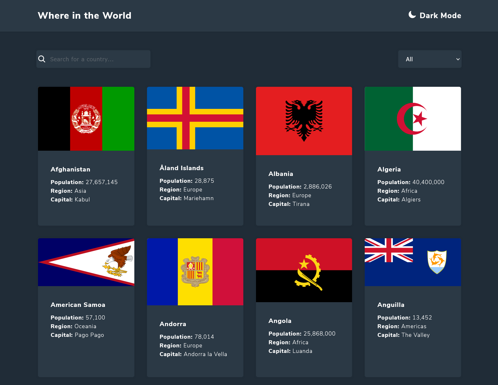
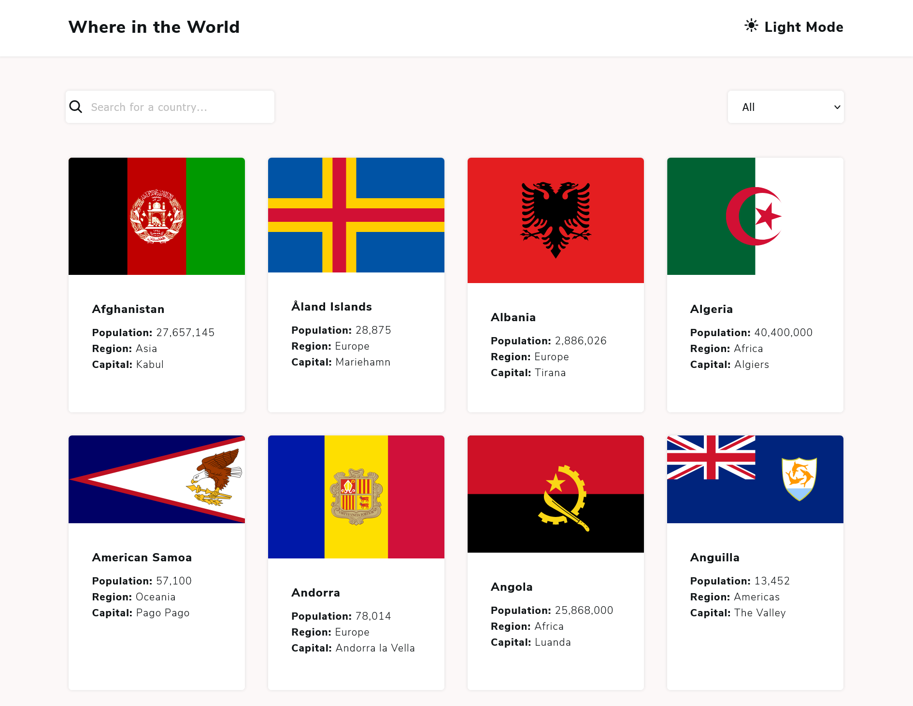
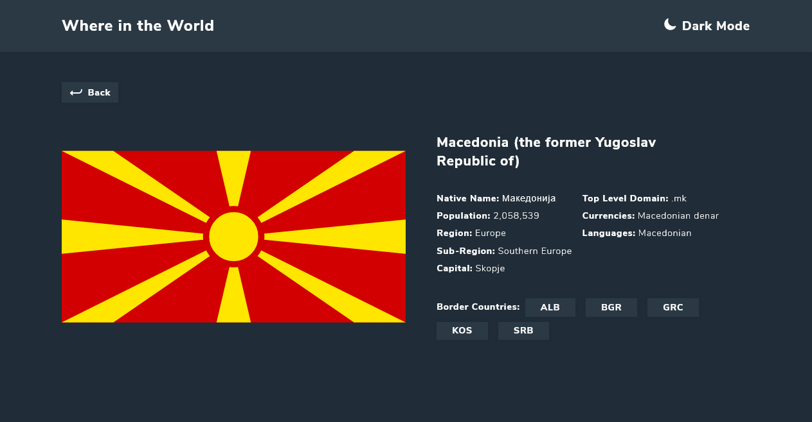
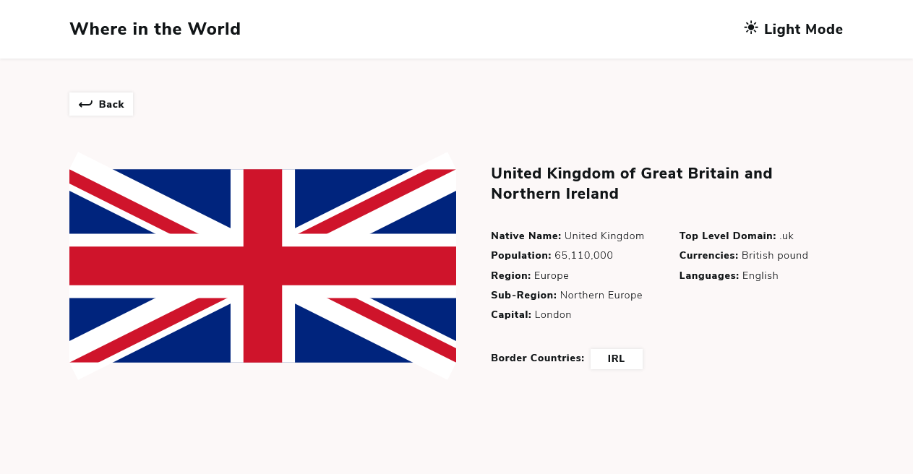
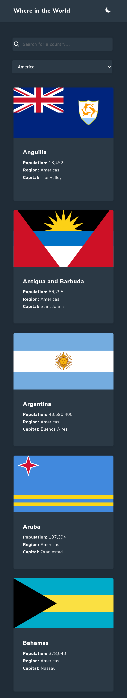
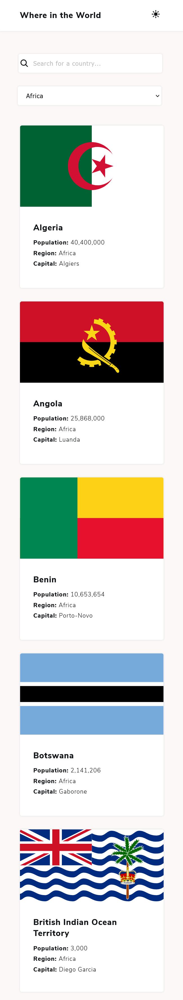
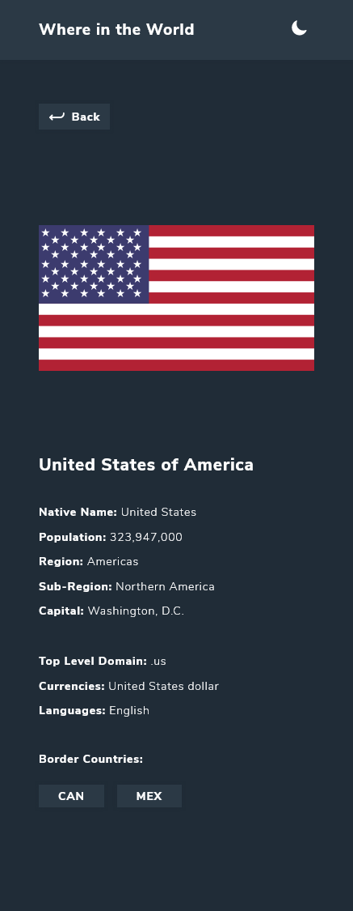
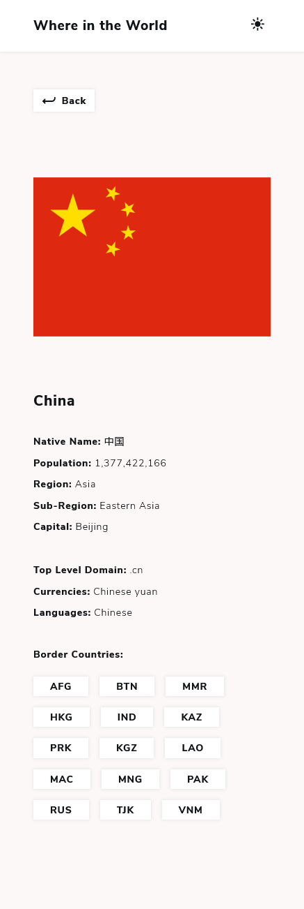

# REST Countries API with color theme switcher

## Table of contents

- [Overview](#overview)
  - [The challenge](#the-challenge)
  - - [Links](#links)
  - [Screenshot](#screenshot)
- [My process](#my-process)
  - [Built with](#built-with)
- [Author](#author)

## Overview

Users should be able to:

- See all countries from the API on the homepage
- Search for a country using an `input` field
- Filter countries by region
- Click on a country to see more detailed information on a separate page
- Click through to the border countries on the detail page
- Toggle the color scheme between light and dark mode _(optional)_

### Links

- GitHub URL: https://github.com/Nesh00/REST-countries-API
- Live Site URL: https://rest-countries-api-nenad.netlify.app/

### Screenshot

## My process

### Built with

- Semantic HTML5 markup
- CSS custom properties
- Flexbox
- JavaScript
- Asynchronous
- REST API

## Author

- LinkedIn - https://www.linkedin.com/in/nenad-tsvetanovski-3101b474/
- Twitter - https://twitter.com/nenad37452460
